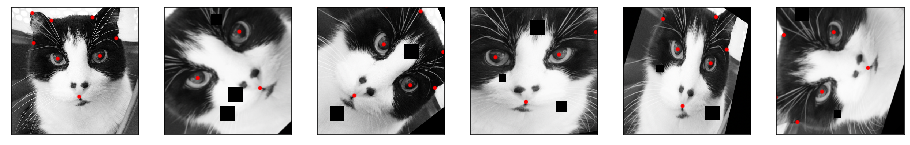
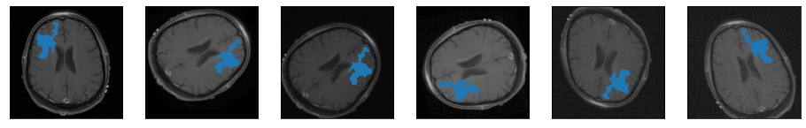
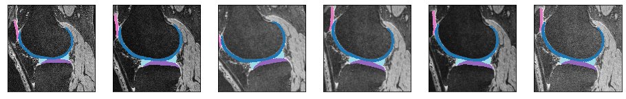

--------------------------------------------------------------------------------
[](https://badge.fury.io/py/solt)
[](https://travis-ci.org/MIPT-Oulu/solt)
[](https://codecov.io/gh/MIPT-Oulu/solt)
[](https://www.codacy.com/app/lext/solt?utm_source=github.com&amp;utm_medium=referral&amp;utm_content=MIPT-Oulu/solt&amp;utm_campaign=Badge_Grade)
[](LICENSE.md)
[](https://zenodo.org/badge/latestdoi/143310844)

## Description
Data augmentation libarary for Deep Learning, which supports images, segmentation masks, labels and keypoints. 
Furthermore, SOLT is fast and has OpenCV in its backend. 
Full auto-generated docs and 
examples are available here: [https://mipt-oulu.github.io/solt/](https://mipt-oulu.github.io/solt/).

## Features

- Support of Images, masks and keypoints for all the transforms (including multiple items at the time)
- Fast and PyTorch-integrated
- Convenient and flexible serialization API
- Excellent documentation
- Easy to extend
- 100% Code coverage

## Examples
Images:

Images + Keypoints:

Medical Images + Binary Masks:

Medical Images + Multiclass Masks


E.g. the last row is generated using the following transforms stream.

```
stream = solt.Stream([
    slt.Rotate(angle_range=(-20, 20), p=1, padding='r'),
    slt.Crop((256, 256)),
    solt.SelectiveStream([
        slt.GammaCorrection(gamma_range=0.5, p=1),
        slt.Noise(gain_range=0.1, p=1),
        slt.Blur()    
    ], n=3)
])

img_aug, mask_aug = stream({'image': img, 'mask': mask})
```

If you want to visualize the results, you need to modify the execution of the transforms:

```
img_aug, mask_aug = stream({'image': img, 'mask': mask}, return_torch=False).data
```

## Installation
The most recent version is available in pip:
```
pip install solt
```
You can fetch the most fresh changes from this repository:
```
pip install git+https://github.com/MIPT-Oulu/solt
```

## Benchmark

We propose a fair benchmark based on the refactored version of the one proposed by albumentations 
team, but here, we also convert the results into a PyTorch tensor and do the ImageNet normalization. The
following numbers support a realistic and honest comparison between 
the libraries (number of images per second, the higher - the better):

|                |albumentations<br><small>0.4.3</small>|torchvision (Pillow-SIMD backend)<br><small>0.5.0</small>|augmentor<br><small>0.2.8</small>|solt<br><small>0.1.9</small>|
|----------------|:------------------------------------:|:-------------------------------------------------------:|:-------------------------------:|:--------------------------:|
|HorizontalFlip  |                 2253                 |                          2549                           |              2561               |          **3530**          |
|VerticalFlip    |                 2380                 |                          2557                           |              2572               |          **3740**          |
|RotateAny       |                 1479                 |                          1389                           |               670               |          **2070**          |
|Crop224         |                 2566                 |                          1966                           |              1981               |          **4281**          |
|Crop128         |                 5467                 |                          5738                           |              5720               |          **7186**          |
|Crop64          |                 9285                 |                          9112                           |              9049               |         **10345**          |
|Crop32          |                11979                 |                          10550                          |              10607              |         **12348**          |
|Pad300          |                 1642                 |                           109                           |                -                |          **2631**          |
|VHFlipRotateCrop|                 1574                 |                          1334                           |               616               |          **1889**          |
|HFlipCrop       |                 2391                 |                          1943                           |              1917               |          **3572**          |

Python and library versions: Python 3.7.0 (default, Oct  9 2018, 10:31:47) [GCC 7.3.0], numpy 1.18.1, pillow-simd 7.0.0.post3, opencv-python 4.2.0.32, scikit-image 0.16.2, scipy 1.4.1.

The code was run on AMD Threadripper 1900. Please find the details about the benchmark [here](BENCHMARK.md).

## How to contribute
Follow the guidelines described [here](CONTRIBUTING.md). 

## Author
Aleksei Tiulpin, 
Research Unit of Medical Imaging, 
Physics and Technology, 
University of Oulu, Finalnd.

## How to cite
If you use SOLT and cite it in your research, please, 
don't hesitate to sent an email to Aleksei Tiulpin. 
All the papers that use SOLT are listed [here](PAPERS.md). 

```
@misc{solt2019,
  author       = {Aleksei Tiulpin},
  title        = {SOLT: Streaming over Lightweight Transformations},
  month        = jul,
  year         = 2019,
  version      = {v0.1.9},
  doi          = {10.5281/zenodo.3702819},
  url          = {https://doi.org/10.5281/zenodo.3702819}
}
```
