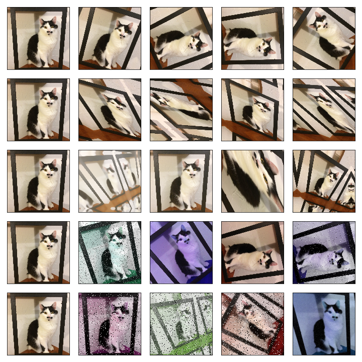

--------------------------------------------------------------------------------
[](https://badge.fury.io/py/solt)
[](https://travis-ci.org/MIPT-Oulu/solt)
[](https://codecov.io/gh/MIPT-Oulu/solt)
[](https://www.codacy.com/app/lext/solt?utm_source=github.com&amp;utm_medium=referral&amp;utm_content=MIPT-Oulu/solt&amp;utm_campaign=Badge_Grade)
[](LICENSE.md)
## Description
Data augmentation libarary for Deep Learning, which supports images, segmentation masks, labels and keypoints. 
Furthermore, SOLT is fast and has OpenCV in its backend. 
Full auto-generated docs and 
examples are available here: [https://mipt-oulu.github.io/solt/](https://mipt-oulu.github.io/solt/).

## Installation
The most recent version is available in pip:
```
pip install solt
```
You can fetch the most fresh changes from this repository:
```
pip install git+https://github.com/MIPT-Oulu/solt
```

## Example
In the snippet below, you can find the usage example of **solt**:

```python
import solt.core as slc
import solt.transforms as slt
import solt.data as sld
import cv2

img = cv2.imread('cat.jpg')
img = cv2.cvtColor(img, cv2.COLOR_BGR2RGB)
H, W = img.shape[:-1]

augs_stream = slc.Stream([
    slt.RandomProjection(
            slc.Stream([
                slt.RandomScale(range_x=(0.5, 1.3), p=1),
                slt.RandomRotate(rotation_range=(-90, 90), p=1),
                slt.RandomShear(range_x=(-0.5, 0.5), range_y=None, p=1),
        ]),
        v_range=(1e-6, 3e-4)),
    slt.ImageGammaCorrection(p=0.5, gamma_range=(0.5, 3)),
    slc.SelectiveStream([
        slt.ImageBlur(p=0.5, blur_type='g', k_size=(11, 21, 31), gaussian_sigma=(1, 10)),
        slt.ImageBlur(p=0.5, blur_type='m', k_size=(11, 21, 31)),
    ]),
    slt.ImageRandomHSV(p=1, h_range=(-720, 720), s_range=(-40, 40), v_range=(-40, 40)),
    slc.SelectiveStream([
        slt.ImageSaltAndPepper(p=1),
        slt.ImageAdditiveGaussianNoise(p=1)
    ]),
    slc.SelectiveStream([
        slt.ImageBlur(p=0.5, blur_type='g', k_size=(11, 21, 31), gaussian_sigma=(1, 10)),
        slt.ImageBlur(p=0.5, blur_type='m', k_size=(11, 21, 31)),
    ]),
    slt.PadTransform(min(H, W), padding='r'),
    slt.CropTransform(min(H,W), 'c')
], padding='r')

dc_res = augs_stream(sld.DataContainer(img, 'I'))

````

The last row in this image was obtained using the code snipped above:

.


## Author
Aleksei Tiulpin, 
Research Unit of Medical Imaging, 
Physics and Technology, 
University of Oulu, Finalnd.
